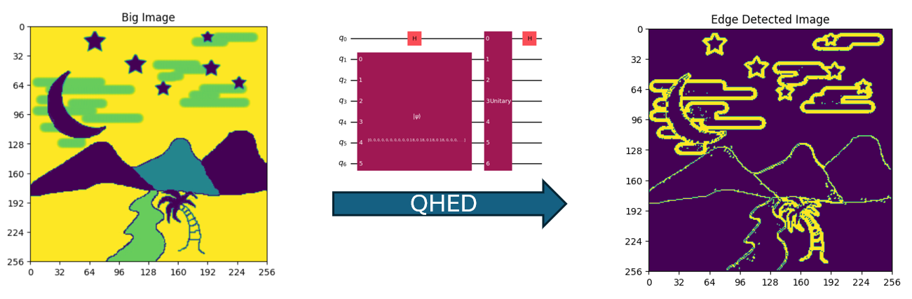
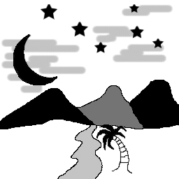
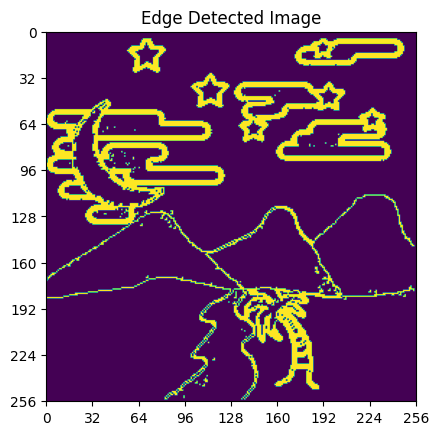
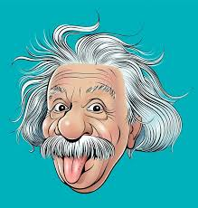

# Quantum-Hadamard-Edge-Detection-QHED-

## Wecolme to Quantum Talent Accelerator, Project3:

In this course, you will learn how to use qiskit to build QHED.

You should be able to find all the course material under the `Course_Material` folder.

## Tasks:

### 0. Find online code implementation of QHED

Please find any code implementation of QHED online. The qiskit IBM textbook will be helpful.

Note that their version can be outdated. Please try to change their versions yourself.

### 1. Large Image edge Detection:

You are given the following image.

Try to obtain the edge of the image, the following is the expected output.

Since the edge depends on your threshold value, you are not required to obtain exactly the same image.

**Hints**: 

1. Notice that the image is very large. If you apply QHED directly, it will results in many qubits. 

This is not very practical. Try to use a smaller crop size and deal with a small subsets of image one at a time.

2. If you merge the cropped images side by side directly, something unexpected will happen. What should you do?

3. The outcome of the image is very sensitive to the threshold value. Try experimenting with different threshold.

### 2. Arbitary image size and multiple color channels.

You are given the following image.

Note that it is $(m,n,3)$ image. How can you modify the previous code to handle this?

**Hints**: 

1. Althought the $m,n$ of the given image is still even, what should you do if it is odd? 

    Remember to take this into consideration.

### 3. Laplacian Edge

Instead of gradient, some people like to use Laplacian to define edge.

Now, pixel (i,j) is an edge iff Laplacian of pixel (i,j) is closed to zero.

Try to implement it using finite difference method.

**Hints**

1. Find online what is the numerical definition of Laplacian.

2. Instead of carring out QHED mutiple times, is it possible to modify the algorithm a little bit by adding extra qubits and new 

gates?